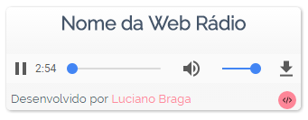

# Player Web Rádio
 
Player para Web Rádio

# Demonstração

Você pode ver o player funcionando aqui: [Demostração](https://lucianobragaweb.github.io/webradio-player/)

# Instalação

A instalação mais simples é através do script em sua página web informando os parametros das webrádio que você pretende tocar através do player.

``

# Instalação Personalizada
Basta baixar os arquivos e importar em seu servidor web.
Para instalar em uma página web basta utilizar o código abaixo, subistituindo pelo endereço do seu servidor.

``

* Opções

Opção           | Exemplo                           | Descrição
----------------|---------------------------------- | ----------------------------------
player-tytle    |player-tytle="Nome da Web Rádio"   | Nome da Web Rádio
player-ip       |player-ip="170.75.145.138"         | IP do servidor da Web Rádio
player-porta    |player-porta="18134"               | Porta do Servidor
player-autoplay |player-autoplay="true"             | Define o Autoplay (true/false)

# Futuras implementações
* Escolha de Temas

# English Version
Coming soon...
